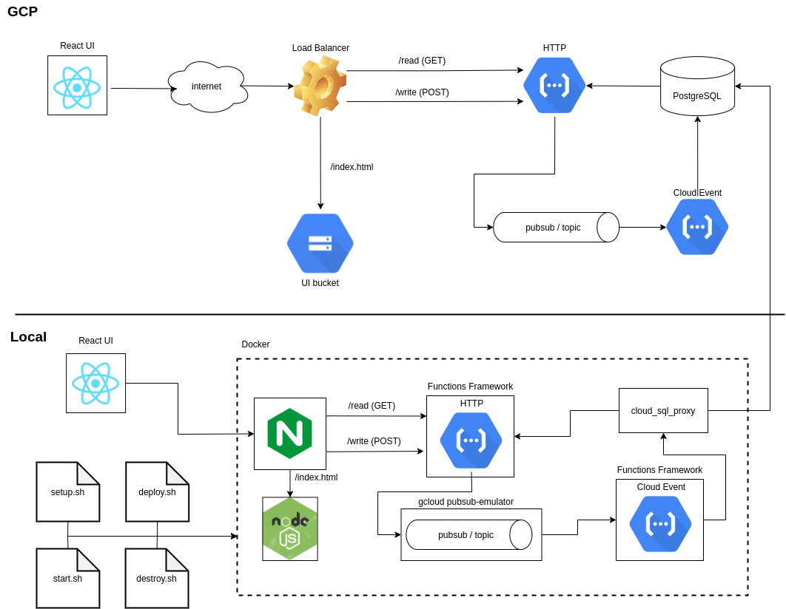

# Google Cloud Reference Implementation


###### A template project to illustrate how to build a typical web-based application in a serverless fashion on the Google Cloud Platform.

###### The intended purpose of this project is to provide a functional example of a serverless application to serve as a starting point for new projects. All GCP resources are defined using Terraform. A Docker container is provided to support local development (debugging, etc.).

###### A crude React UI POSTs data to the address of the load balancer, which forwards the request to the HTTP-handling cloud function. The cloud function publishes the body of the request to pubsub. A cloud-event function then asynchronously receives the message and writes the content to the PostgreSQL instance. The same HTTP-handling cloud function is then used to read data in a separate GET request from the UI.

### Architecture




### Prerequisites
1. Docker installed
2. A Google Cloud Platform account with billing enabled

### Setup

1. Run `setup.sh`, which will do the following:

    - Install `gcloud` tool suite
    - Prompt for authentication using `gcloud`
    - Create a new project
    - Link billing info to the new project
    - Enable all required APIs on the project
    - Create a service account
    - Download the service account's key file
    - Example: `./setup.sh --project-id my-project-id --display-name "My Display Name"`
2. Run `deploy.sh`, which will do the following:
    - Install Terraform
    - Detect a virtual environment and prompt to create one if necessary
    - Apply the Terraform file
    - Build and upload the UI files
    - Note that the first execution must build the Docker container and will take extra time
3. [Optional] Verify successful cloud deployment
    - After deployment, it may take 3-10 minutes for the changes to propagate to the edge nodes
    - [Find the IP address of the load balancer](https://console.cloud.google.com/net-services/loadbalancing/loadBalancers/list?project=<PROJECT_ID>)
    - Navigate to the UI: `http://<IP_ADDRESS>/index.html`
4. Run `start.sh`
    - This will start the docker container that hosts the local deployment of the serverless resources
    - Browse to `http://localhost/index.html`
5. [Optional] Run `stop.sh`
    - This will stop the docker container
6. [Optional] Run `destroy.sh`
    - This will teardown all cloud resources 
    - Note that there is currently some problem with Terraform's ability to delete the database user. [Do so manually via the cloud console](https://console.cloud.google.com/sql/instances/just-testing/users) to avoid problems *before* running this script

### Notes

1. After deployment, it may take 3-10 minutes for the changes to propagate to the edge nodes.
2. Set `export TF_LOG=TRACE` to debug Terraform issues
3. The docker container reads the Terraform state file (`./terraform/terraform.tfstate`) in order to discover which resources it needs to create locally (topics, subscriptions, etc.); it will not start correctly if the project is not deployed to the cloud

### FAQ
1. How to enable debugging in VS Code?
    - Each cloud function should have a `config.json` file, with a `debug-port` property that specifies the port on which to listen for debugger connections. The port specified must be unique for each defined cloud function
    - Create a debug launch configuraton file and add a configuration similar to the following: 
    <br/><br/>
    ```
    {
        "name": "HTTP Cloud Function",
        "type": "python",
        "request": "attach",
        "connect": {
            "host": "0.0.0.0",
            "port": 9000
        },
        "pathMappings": [
            {
                "localRoot": "${workspaceFolder}/src",
                "remoteRoot": "/app/workspace/src"
            }
        ]
    }
    ```
    - A separate launch configuration is required for each function (only the port needs to be different)
    - Note that at the time of writting, the debugger does not disconnect; simply restart the container
    - Note that debugging the `pubsub` function may result in duplicate entries added to the database, due to pubsub thinking that it must retry due to the function not acking expediently
2. How to enable debugging in PyCharm?
    - Not supported 